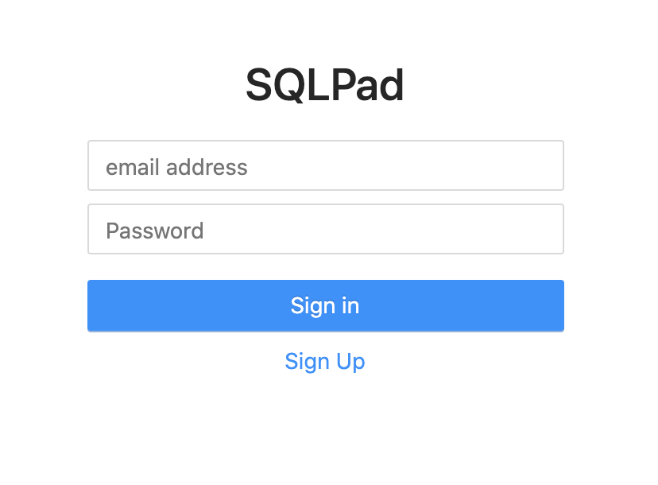
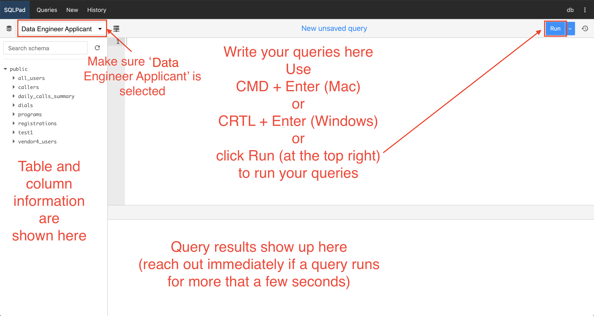

# SQL Queries

Target time: 60 mins

_**Reminder:** Before you get started on this task, verify that you can log into
the online platform as described in [Setup](#setup)._

## Overview

We are working with **Vendor X**, and need to ingest their data into our data
warehouse. They send us a daily file, `data/vendor_x_data.csv` and also send
completed registration data to a **QC Vendor** we have an existing data sync
with in order to quality check the registrations. _Even though you uploaded
Vendor X's data as part of the data wrangling task, use the
`public.vendor_x_registrations_raw` table for this task_.

We need our Data Engineer to:

1. Create a deduped version of the Vendor X table,
   `public.vendor_x_registrations_raw`, by removing duplicate rows that appear
   for each registration status
   1. Schema name (the result of this query using your username):
      `select 's_'||md5('<your sqlpad username>');`
   2. Table name: `vendor_x_registrations_deduped`
2. Create a table, `all_records`. Format and add the deduped set of Vendor X
   records to that table by editing `all_records_generation_TO_EDIT.sql`.
   Because completed registrations appear in the QC Vendor table
   `qc_vendor_data` that feeds into `all_records`, you'll need to ensure that
   you've removed the duplicate _complete_ records that appear in both tables.
   1. Schema name (the result of this query using your username):
      `select 's_'||md5('<your sqlpad username>');`
   2. Table name: `all_records`

### Additional information for processing Vendor X data

- Vendor X sends one record for each step in the registration process that has
  been completed, e.g. a complete registration would have a total of 5 rows in
  the data: one row for each of steps 1-4 and one row for "complete." The step
  or completion associated with each row is in the `status` field. We also need
  to dedupe the multiple records per registration that we receive from Vendor X
  using the `status` column. Unique registrations can be determined using the
  `vendor_id` field, meaning a complete registration will have 5 rows each with
  the same `vendor_id`.
- When inserting Vendor X registrations into all_records, tag them with
  program_type = 'field', and program_sub_type = 'evc_funded'. Please use the
  source column registration_source to populate collection_medium in the final
  all_records table. The fields evc_month and evc_year should be generated by
  extracting the relevant date parts from registration_date. There may be
  several other columns that do not appear in the Vendor X data and should be
  imputed with null values, or columns that require some transformation to match
  the data type in the `qc_vendor_data` table.
- `vendor_id` from Vendor X data corresponds to `application_id` in the QC
  Vendor data. All completed Vendor X (e.g. have reached `status = ‘Complete’`)
  records are sent to our QC Vendor, so they appear in the `qc_vendor_data`
  table. Remove those duplicate "complete" records so that the final
  `all_records` table does not have any duplicates.

## Setup

We have set up a sandbox database and have created a unique user for you to use.
Visit http://68.183.51.176/ and log in using your email address and the last
four digits of your phone number. Once logged in, select **Data Engineer
Applicant** as the connection (near the top left).

_Before you get started, verify you can access it and reach out immediately if
you have any issues connecting or querying._

## Deliverables:

1. [Deduped table created in the database]
2. SQL source code for creating the deduped table
3. [all_records table created in the database]
4. Edited copy of `all_records_generation_TO_EDIT.sql`

## Tips

- Add comments to your code to give more context
